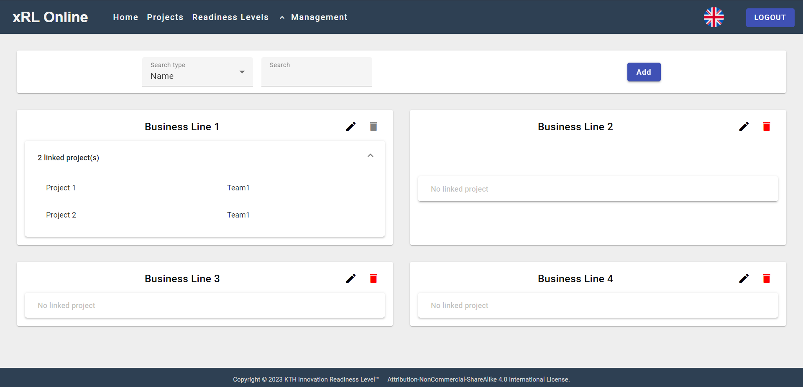
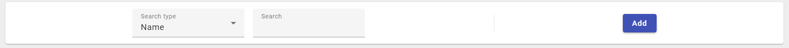
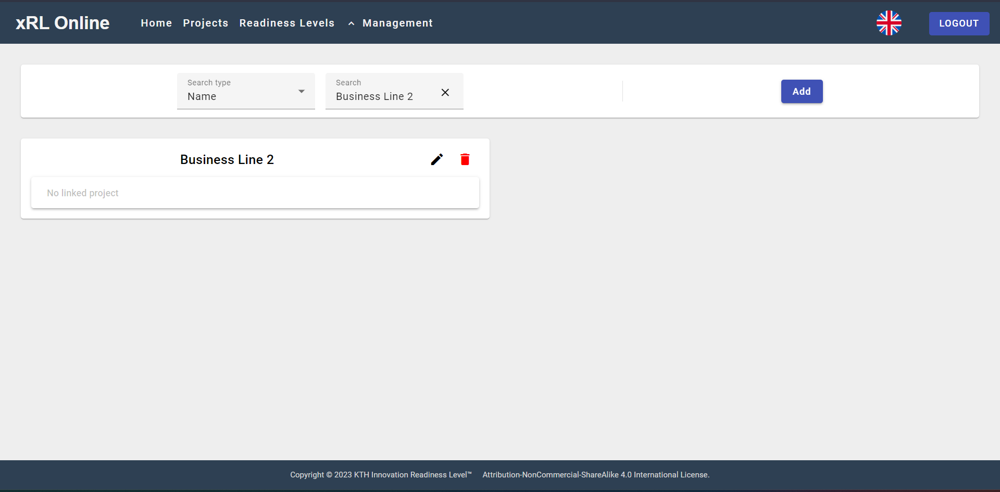
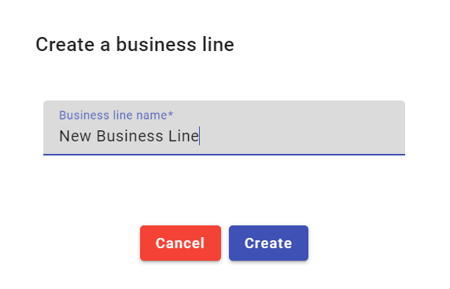
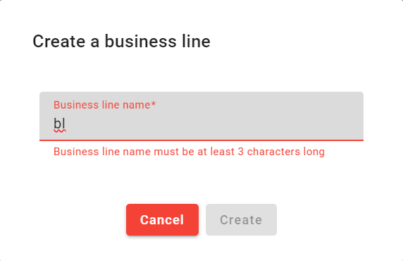
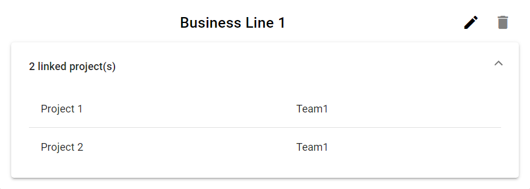
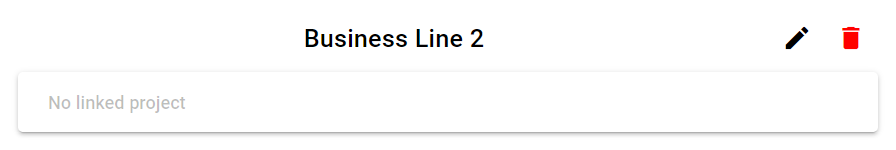
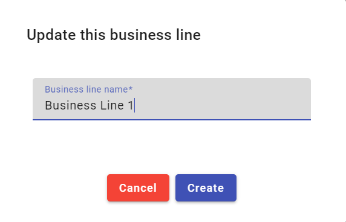
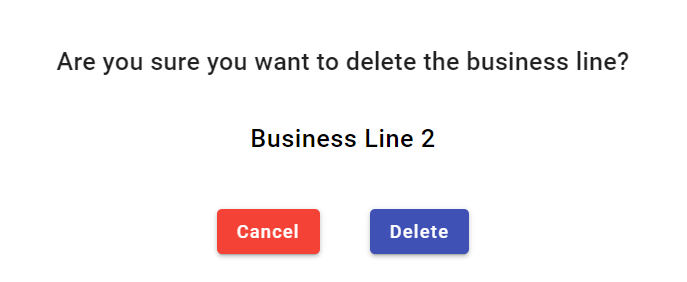

# Business-Line-Management-Page

This page aims to manage (create, update, delete) [Business Line](/user-doc/business-line)
  It is made of two parts.

## Search bar

At the top, a search bar with a filter by name allows the Admin to search a Business Line by Name

Then by clicking the "add Button" the Admin can create a whole new Business Line.

A dialog then appears and ask the Admin to fill the name of the Business Line.

The Admin have to respect the field criterias:

- Not less than 3 characters
- Not more than 20 characters

## Business Line cards

Every project card contains:

- The Name of the BusinessLine
- A button to edit the BusinessLine
- A button to delete the BusinessLine
- A expansion pannel to see the Projects which are linked to the BusinessLine
  

The edit button opens a dialog similar to the creation dialog.

If the BusinessLine is not linked to any Project, the Admin can delete it by clicking the delete button.
Which will open a similar [dialog]() than to others delete dialog.

