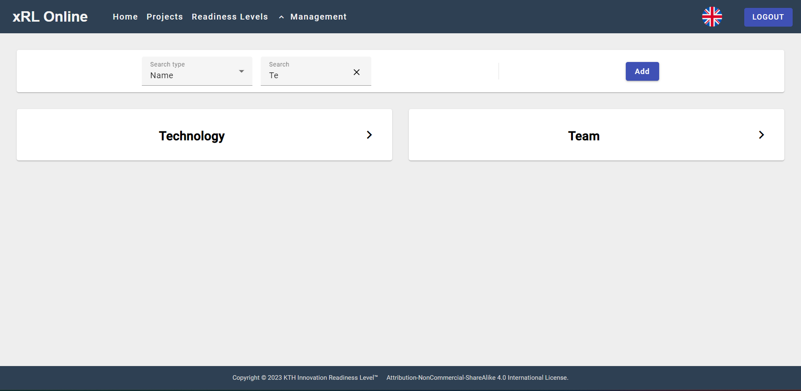
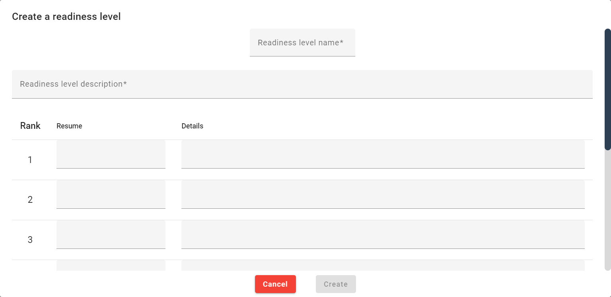
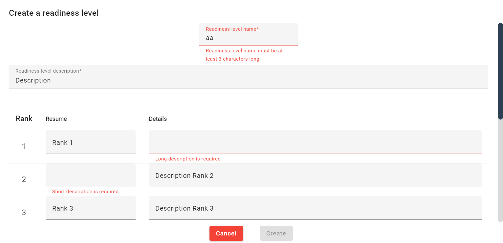
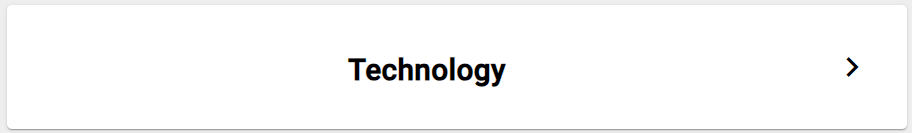
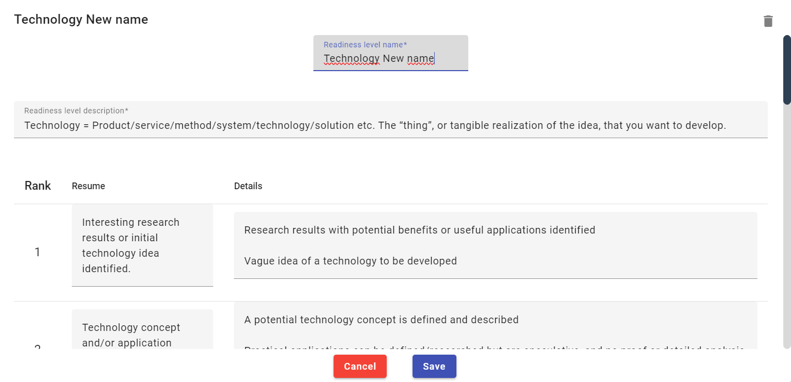
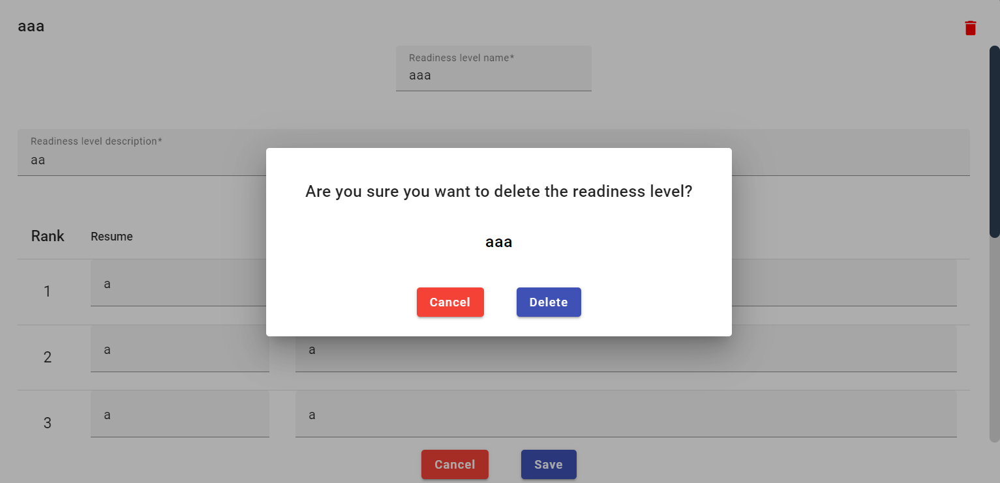

# Readiness-Levels-Management-Page

This page aims to manage (create, update, delete) [Readiness Levels](/user-doc/readiness-levels)
  It is made of two parts.

![![Page]](../assets/screenshots/readiness-levels-management-page/page.png)

## Search bar

At the top, a search bar with a filter by name allows the Admin to search a Readiness Level by name

![[Search bar]](../assets/screenshots/readiness-levels-management-page/search_bar.png)

Then by clicking the "add Button" the Admin can create a whole new Readiness Level.

A dialog then appears and ask the Admin to fill differents informations:

- Readiness Level Name
- Description
- Short Description (for each rank from 1 to 9)
- Long Description (for each rank from 1 to 9)

The Admin have to respect the field criterias:

1. Readiness Level Name
    - Not less than 3 characters
    - Not more than 20 characters
2. Descriptions (Readiness Level Description, Short Description, Long Description)
    - At least one character
    - Not more than 1000 characters

## Readiness Level cards

Every project card contains the name of the Readiness Level. 
  

Clicking on the card will open a dialog with the Readiness Level informations and the Admin can update it.

If the Readiness Level is not linked to any Project, the Admin can delete it by clicking the delete button in the dialog at the top right corner.
Which will open a similar dialog than to others delete dialog.

