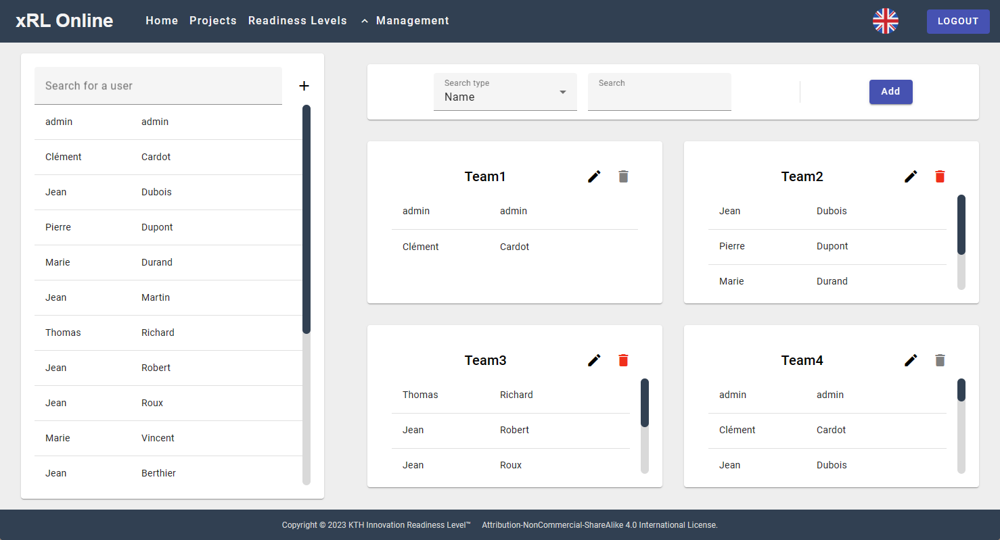
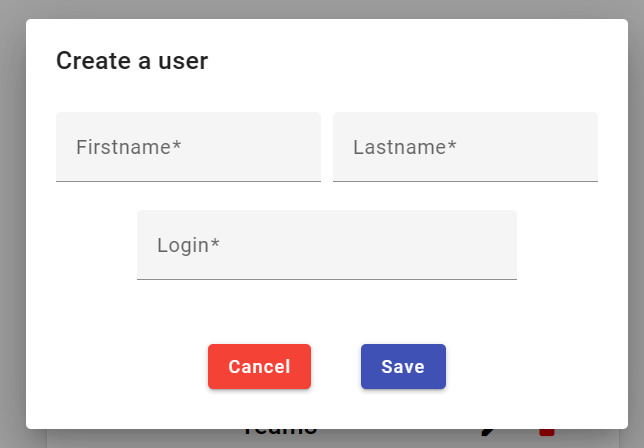
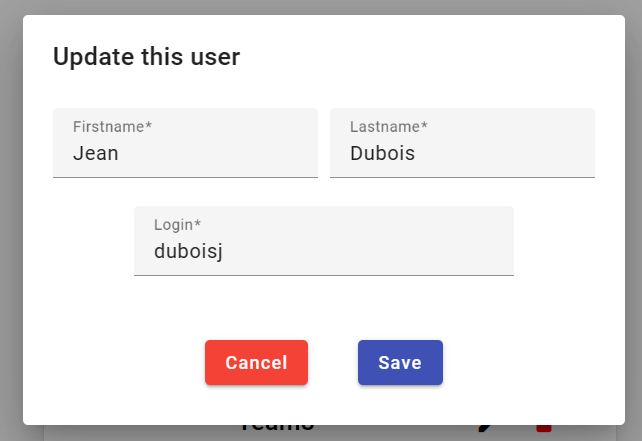
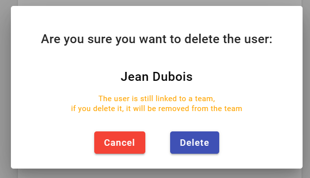

# Teams/Users-Management-Page

This page aims to manage (create, update, delete) Teams & Users
  It is made of two parts.

## Users Management

The left section of the page is used to manage users (name, first name, and login).

A search bar allows the Admin to search a user by his name or first name.

Then by clicking the "+" button the Admin can create a new user.

A dialog then appears and ask the Admin to fill the first name, last name and login of the new user.

The Admin have to respect the field criterias:

- All field are required
- Not less than 3 characters
- Not more than 20 characters

By hovering a user in the list, 2 icons appear : Edit & delete 
Both open a dialog:

- The Edit dialog is the same as the Create dialog, the fields must respect the same conditions

- The Delete dialog asks for confirmation before permanently deleting the user. It also warns if the user is linked to a team

## Teams Management

### Search bar

At the top, a search bar with a filter by name allows the Admin to search a Team by name. With a filter by User, it allows the Admin to search a Team by a user's firstname or last name

Then by clicking the "add Button" the Admin can create a whole new Team.

A dialog then appears and ask the Admin to fill the name of the Team and to add members among all existing users. 

The Admin have to respect the name field criterias:

- Not less than 3 characters
- Not more than 20 characters

### Team cards

Every card contains:

- The Name of the Team
- A pen icon to edit the Team
- A bin icon to delete the Team
- The list of team members
  
The Edit dialog is the same as the Create dialog, the field must respect the same conditions

The Delete dialog asks for confirmation before permanently deleting the Team.

If the Team is linked to a project, it becomes impossible to delete it: the bin is disabled.

