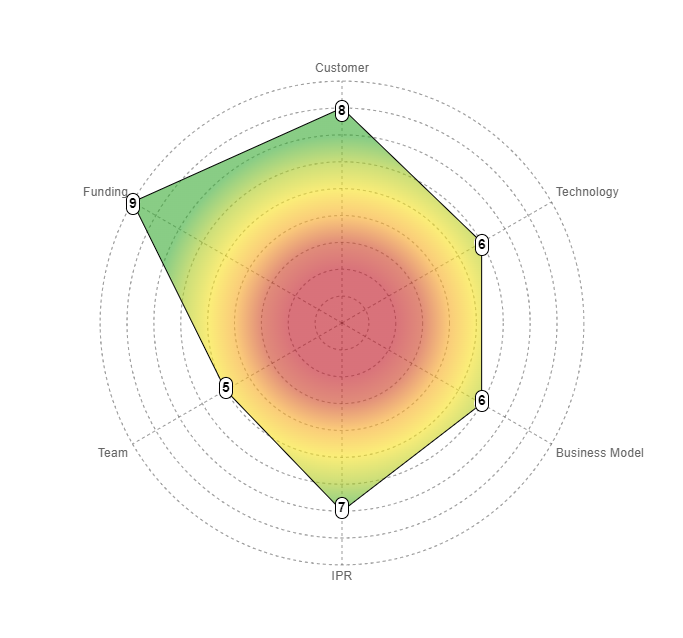

# Charts

Our application has two types of charts: radar charts and gauge charts.

## Radar charts

The radar charts are used to display an assessment of a project. It is composed of x axes, each one representing a readiness level.

We used [Chart.js](https://www.chartjs.org/) to create the radar charts.

## Gauge charts

The gauge charts are used to display a rank on a readiness level of a project.

We used [ApexCharts](https://apexcharts.com/) to create the gauge charts.

