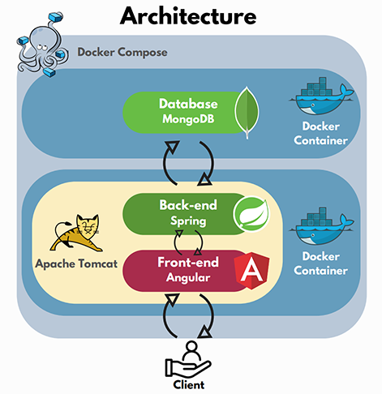

# Docker
Docker is a platform for developing, shipping, and running applications in containers. Containers are lightweight, portable, and self-sufficient units that encapsulate an application and its dependencies, enabling consistent and efficient deployment across different computing environments.

Docker Compose is a tool that allows you to define and manage multi-container Docker applications. It uses a YAML file to configure the services, networks, and volumes required for an application, making it easier to deploy and run complex, interconnected applications with Docker.

We used docker to define our development and production environments.
Using Docker compose, we divided our architecture into two parts, hosting the front and back end via a tomcat container and the database on a dedicated mongodb container.



## Tomcat DockerFile

The Tomcat Dockerfile is divided in 4 steps :
- Back End Build
- Front End Build
- Documentation Build
- Deploy Step

Let's deep dive into each step !

### Back End Build

Nothing to say here, just a simple maven build

```DOCKERFILE title="Dockerfile"
# BACK BUILD STAGE
FROM maven:3.8.1-openjdk-17 AS back-build
COPY ./back /back
WORKDIR /back
RUN mvn clean package -P prod -DskipTests
```

### Front End Build

For the front end build, to avoid reproduicing each time the dependencies download with ``npm install``, 
we have separated the dependencies download from the build so that we can use the docker cache for the next build.

We also have put Placeholder in comment so that our pipeline can replace them with command line to set the proxy.

```DOCKERFILE title="Dockerfile"
# FRONT BUILD STAGE 1 DEPENDENCIES
FROM node:18.18.0-alpine AS front-dependencies
COPY ./front /front
WORKDIR /front
# Do not remove the following lines, they are used by the gitlab pipeline to set proxy for npm
#PLACEHOLDER1
#PLACEHOLDER2
RUN npm install
RUN npm install -g @angular/cli

# FRONT BUILD STAGE 2 BUILD
FROM front-dependencies AS front-build
COPY --from=front-dependencies /front /front
RUN ng build --configuration=production
```

### Documentation Build

The documentation is also hosted by tomcat. We just simply build it with mkdocs.

```DOCKERFILE title="Dockerfile"
# DOCS BUILD STAGE
FROM python:3.9.18-alpine AS docs-build
COPY ./docs /workspace/docs
COPY mkdocs.yml /workspace/mkdocs.yml
WORKDIR /workspace
# Do not remove the following line, it is used by the gitlab pipeline to set proxy for pip
#PLACEHOLDER3
RUN pip install mkdocs
RUN mkdocs build
```

### Deploy Step

After configuring our Tomcat instance, we copy the result of our previous builds.

```DOCKERFILE title="Dockerfile"
# DEPLOY STAGE
FROM tomcat:10.1.13-jre17

# Configure Tomcat
RUN cp -r "$CATALINA_HOME/webapps.dist/host-manager" "$CATALINA_HOME/webapps/host-manager"
RUN cp -r "$CATALINA_HOME/webapps.dist/manager" "$CATALINA_HOME/webapps/manager"

COPY .tomcat/tomcat-users.xml /usr/local/tomcat/conf/tomcat-users.xml
COPY .tomcat/context.xml /usr/local/tomcat/conf/context.xml
COPY .tomcat/context.xml /usr/local/tomcat/webapps/host-manager/META-INF/context.xml
COPY .tomcat/context.xml /usr/local/tomcat/webapps/manager/META-INF/context.xml

# Deploy Back End
COPY --from=back-build /back/target/xrlonline-back-*.war /usr/local/tomcat/webapps/api.war

# Deploy Front End
COPY --from=front-build /front/dist/xrl /usr/local/tomcat/webapps/ROOT

# Deploy Docs
COPY --from=docs-build /workspace/site /usr/local/tomcat/webapps/docs
```

## MongoDB DockerFile

This is the Dockerfile of the mongoDB container.
After Copying the content of our db folder, we make the scripts executables and use dos2unix to avoid line endings issues when building from windows (the dos2unix step may be deleted before building from unix environnement)
We also use cron to create a back up routine, by executing our backup script check [MongoDB Page](mongodb.md) for more information about backup.
The routine is set for an execution each day at 00:00 (hour of the host machine).

Then we execute out compilation of script and configure mongodb to start with the mongo-init.js script that have been generated. More information about those script in the [MongoDB Page](mongodb.md).

```DOCKERFILE title="db/Dockerfile"
FROM mongo:7.0-rc-jammy

COPY ./mongod.conf /etc/mongod.conf

COPY ./DB_Collections /build/DB_Collections/
COPY ./DB_Insert /build/DB_Insert/
COPY ./init_database.js /build/
COPY ./compile_db_script.sh /build/
COPY ./auto_dump.sh /build/

RUN chmod +x /build/compile_db_script.sh
RUN chmod +x /build/auto_dump.sh

# Install dos2unix to convert line endings to unix format
RUN apt-get update && apt-get install -y dos2unix vim && rm -rf /var/lib/apt/lists/* /var/cache/apt/archives/*
RUN dos2unix /build/compile_db_script.sh
RUN dos2unix /build/auto_dump.sh
RUN apt-get --purge remove -y dos2unix

# Create a back up routine with cron
RUN apt-get update && apt-get install -y cron && rm -rf /var/lib/apt/lists/* /var/cache/apt/archives/*
RUN crontab -l | { cat; echo "0 0 * * * /build/auto_dump.sh"; } | crontab -
RUN service cron start

WORKDIR /build
RUN /build/compile_db_script.sh
RUN mv /build/mongo-init.js /docker-entrypoint-initdb.d/mongo-init.js
```

## Docker Compose

The docker compose file allow you to define your services, add volumes, manage open ports and a lot more !

Here you can see that our mongoDB container works with port 27017 and our tomcat with the port 8080.
We also have configurated a volume for tomcat in order to access to the logs, and an other volume with mongoDB in order to access to the database backup if needed.

```yaml title="docker-compose.yml"
version: '3'
services:
  mongodb:
    image: [Your Docker Registry]/xrl-online-db
    build:
      context: db
      dockerfile: Dockerfile
    ports:
      - "27017:27017"
    volumes:
      - ./mongo_backup:/mongo_backup

  tomcat:
    image: [Your Docker Registry]/xrl-online-tomcat
    build:
      context: .
      dockerfile: Dockerfile
    ports:
      - "8080:8080"
    depends_on:
      - mongodb
    volumes:
      - ./logs:/usr/local/tomcat/logs
```