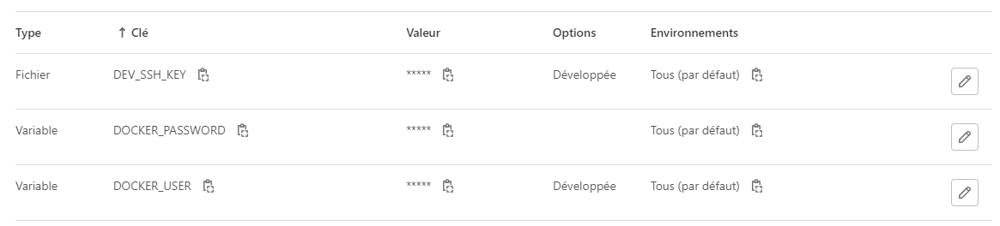

# CI/CD

The purpose of this document is to explain and document the ``.gitlab-ci.yml`` in order to make anybody able to reproduce the same pipeline in his environnment, with gitlab or not.


For any questions about the CI/CD YAML syntax please refer to the gitlab documentation :<br>
[CI/CD YAML syntax reference](https://docs.gitlab.com/ee/ci/yaml/)

The CI/CD we used is managed by GitLab CI/CD. <br>
The configuration file is located in the root of the project : ``.gitlab-ci.yml``.

We are going to detail each part of this file.

## Stages definition

The pipeline is composed of 6 main stages:

- **build** : Build the front & back applications in order to verify that the compilation doesn't fail
- **test** : Run the unit tests of back-end
- **sonar** : Run the sonar analysis
- **release** : We use docker compose to release our 2 images (mongodb & tomcat) in a docker registry
- **deploy** : We connect via ssh to our server and deploy our 2 new images
- **e2e** : When our server is started, we run our E2E tests to ensure that everything is working properly

```.yml  title=".gitlab-ci.yml"
stages:
  - build
  - test
  - sonar
  - release
  - deploy
  - e2e
```

*Note : This definition allows us to categorize each stage and to create a execution order (order of the list)*

## Variables definition

Our pipeline depends on parameters, some of them are publicly written directly to the ``.gitlab-ci.yml`` file, but for security, some of them are stored by the gitlab instance

In the ``.gitlab-ci.yml`` file we will find variables like :

- Proxy configuration (mostly for maven)
- Dev serveur IP
- Dev serveur username for login
- Potentially a private docker repository

```.yml title=".gitlab-ci.yml"
variables:
  MAVEN_OPTS: "-Dhttp.proxyHost=[PROXY IP] -Dhttp.proxyPort=[PROXY PORT] -Dhttps.proxyHost=[PROXY IP] -Dhttps.proxyPort=[PROXY PORT] -Dhttps.protocols=TLSv1.2 -Dmaven.repo.local=$CI_PROJECT_DIR/.m2/repository -Dorg.slf4j.simpleLogger.log.org.apache.maven.cli.transfer.Slf4jMavenTransferListener=WARN -Dorg.slf4j.simpleLogger.showDateTime=true -Djava.awt.headless=true"
  MAVEN_CLI_OPTS: "--batch-mode --errors --fail-at-end --show-version -DinstallAtEnd=true -DdeployAtEnd=true"
  DEV_SERVER_IP: [DEV SERVER IP]
  DEV_SERVER_USER: [DEV SERVER USERNAME]
  DOCKER_IMAGE_REPOSITORY_URL: [DOCKER REGISTRY IP]:[DOCKER REGISTRY PORT]
```

In the gitlab instance (see picture below), we will store variables like :

- SSH Key of the Dev server
- Username & password of the docker account to connect to the docker registry




## Before script

As we said before, if you are under a proxy, it is mandatory to configure your running containers that they have to use it, that why we use the before_script tag to do that.<br>
For each job, the before_script will export the proxy config to the container before running the rest of the script 

```.yml  title=".gitlab-ci.yml"
before_script:
  - export https_proxy=http://[PROXY IP]:[PROXY PORT]/
  - export http_proxy=http://[PROXY IP]:[PROXY PORT]/
```

## Jobs

Now it's time to get deeper into each gitlab ci job !

### Build

Build the front & back applications in order to verify that the compilation doesn't fail

#### angular-build

**Image :**<br>
We use a standard node image (choosing a specific version is a good pratice to avoid downloading always a new version from docker.io)

**Script :**<br>
The script enter into the front folder and install the dependencies of the project and the angular CLI.
Then it perform a ``ng build``. If the build fail, the pipeline fail.

**Artifact :**<br>
After the script, gitlab will store for 1 day the folder front/dist which is the result of our build.

**Cache :**<br>
We also configure cache to avoid downloading every dependencies each times (``node_modules``)

```.yml title=".gitlab-ci.yml"
angular-build:
  stage: build
  image: node:18.18.0-alpine
  script:
    - cd front
    - npm install
    - npm install -g @angular/cli
    - ng build
  artifacts:
    paths:
      - front/dist
    expire_in: 1 day
    when: always
  cache:
    paths:
      - front/node_modules
```

#### java-build

**Image :**<br>
We use a standard Maven image with JDK 17

**Script :**<br>
The script enter into the back folder and perfom a ``mvn clean package`` without unit tests. This ensure us that the compilation works.

**Artifact :**<br>
After the script, gitlab will store for 1 day the ``back/target/xrlonline-*.war`` which is the result of our build.<br>
We will also recover the log of maven ``$CI_PROJECT_DIR/mvn.log``. <br>
(this practice allow us to limit the CI logs which are not well managed by gitlab)

**Cache :**<br>
We also configure cache to avoid downloading every dependencies each times (``$CI_PROJECT_DIR/.m2/repository``)

```.yml title=".gitlab-ci.yml"
java-build:
  stage: build
  image: maven:3.8.1-openjdk-17
  script:
    - cd back
    - mvn --log-file $CI_PROJECT_DIR/mvn.log $MAVEN_CLI_OPTS $MAVEN_OPTS clean package -DskipTests=true
  artifacts:
    paths:
      - $CI_PROJECT_DIR/mvn.log
      - back/target/xrlonline-*.war
    expire_in: 1 day
    when: always
  cache:
    paths:
      - $CI_PROJECT_DIR/.m2/repository
```

### Test : junit-test

**Image :**<br>
We use a standard Maven image with JDK 17

**Script :**<br>
The script enter into the back folder and perfom a ``mvn compile test``. The goal here is just to execute every unit tests.

The last command is very specific to gitlab. In order to view the coverage percentage in our MR, gitlab allow us to extract this percentage from the job's output by giving it a regular expression (just below the script section).

**Artifact :**<br>
After the script, gitlab will store for 1 day the ``back/target/site/jacoco`` which is the result of our tests.<br>
We will also point to gitlab where are the generated tests report so that we can read them directly in the pipeline interface.<br>
We will also recover the log of maven ``$CI_PROJECT_DIR/mvn.log``. <br>
(this practice allow us to limit the CI logs which are not well managed by gitlab)

**Cache :**<br>
We also configure cache to avoid downloading every dependencies each times (``$CI_PROJECT_DIR/.m2/repository``)

```.yml title=".gitlab-ci.yml"
junit-test:
  stage: test
  image: maven:3.8.1-openjdk-17
  script:
    - cd back
    - mvn --log-file $CI_PROJECT_DIR/mvn.log $MAVEN_CLI_OPTS compile test
    - awk -F"," '{ instructions += $4 + $5; covered += $5 } END { printf "Total Coverage = %.0f%%", 100*covered/instructions }' target/site/jacoco/jacoco.csv
  coverage: '/Total.*?([0-9]{1,3})%/'
  artifacts:
    reports:
      junit: back/target/surefire-reports/TEST*.xml
    paths:
      - back/target/site/jacoco
      - $CI_PROJECT_DIR/mvn.log
    expire_in: 1 day
    when: always
  cache:
    paths:
      - $CI_PROJECT_DIR/.m2/repository
  needs:
    - job: java-build
      artifacts: true
```

### Sonar : quality-dev

**Image :**<br>
We use a standard Maven image with JDK 17

**Script :**<br>
The script enter into the back folder and perfom a ``mvn clean compile test``. The goal here is just to execute every unit tests again in order to send the result to sonar.<br>
When tests are done, we execute the sonar scan and connect to our private sonar instance to synchronize the result of the scan.

**Artifact :**<br>
We will recover the log of maven ``$CI_PROJECT_DIR/mvn_clean_compile_test.log`` and ``$CI_PROJECT_DIR/mvn_sonar.log``. <br>
(this practice allow us to limit the CI logs which are not well managed by gitlab)

**Cache :**<br>
We also configure cache to avoid downloading every dependencies each times (``$CI_PROJECT_DIR/.m2/repository``)

**Needs :**<br>
To improve pipeline efficiency, we can configure needs to explain to gitlab when a job can really start.
Here we just needs the java-build and the junit-test jobs to be succeed.

**Only :**<br>
The only tag allow us to run a job only in certains condition, here, we want the sonar job to run only on the dev branch !

```.yml title=".gitlab-ci.yml"
quality-dev:
  stage: sonar
  image: maven:3.8.1-openjdk-17
  script:
    - cd back
    - mvn --log-file $CI_PROJECT_DIR/mvn_clean_compile_test.log $MAVEN_CLI_OPTS clean compile test
    - mvn --log-file $CI_PROJECT_DIR/mvn_sonar.log $MAVEN_CLI_OPTS validate sonar:sonar -Dsonar.projectKey=xrl_online_project -Dsonar.host.url=[SONAR URL] -Dsonar.login=[SONAR TOKEN]
  artifacts:
    paths:
      - $CI_PROJECT_DIR/mvn_clean_compile_test.log
      - $CI_PROJECT_DIR/mvn_sonar.log
    expire_in: 1 day
    when: always
  cache:
    paths:
      - $CI_PROJECT_DIR/.m2/repository
  needs:
  - job: java-build
    artifacts: true
  - job: junit-test
    artifacts: true
  only:
    - dev
```

### Release : release

**Image :**<br>
We use a standard Docker in Docker image to allow use to use docker command during our script

**Tags :**<br>
Docker in Docker is not enable by default in gitlab runners. It's common to enable it in just few runners. That's why we needs to tel gitlab which runner can execute our job.

**Variables :**<br>
As we are in a DinD environnment, we must set again our proxy configuration

**Script :**<br>
The script will :

- Build our docker compose project
- Connect to the docker registry using the Username and Password variables from the gitlab instance
- Push the generated containers to the registry

**Only :**<br>
The only tag allow us to run a job only in certains condition, here, we want the sonar job to run only on the dev branch !

```.yml title=".gitlab-ci.yml"
release:
  stage: release
  tags:
    - runner9
  variables:
    DOCKER_TLS_CERTDIR: ""
    DOCKER_HOST: "tcp://docker:2375"
    HTTPS_PROXY: "http://[PROXY IP]:[PROXY PORT]/"
    HTTP_PROXY: "http://[PROXY IP]:[PROXY PORT]/"
    NO_PROXY: "[PROXY IP],docker"
  image: docker:24.0.6
  services:
    - docker:24.0.6-dind
  script:
    - docker compose build
    - echo $DOCKER_PASSWORD | docker login --username $DOCKER_USER --password-stdin docker.io
    - docker compose push
  only:
    - dev
```

### Deploy : deploy

**Image :**<br>
We use a standard Docker in Docker image to allow use to use docker command during our script

**Tags :**<br>
Docker in Docker is not enable by default in gitlab runners. It's common to enable it in just few runners. That's why we needs to tel gitlab which runner can execute our job.

**Variables :**<br>
As we are in a DinD environnment, we must set again our proxy configuration

**Script :**<br>
The script will :

- Start the SSH Agent
- Add the SSH key from the gitlab instance into the SSH agent of the runner
- Connect to the docker registry using the Username and Password variables from the gitlab instance
- Via SSH : Kill and remove the actual running containers on the Dev server
- Via SSH : Pull the latest generated containers from the registry
- Via SSH : Start the new containers on the Dev server

**Needs :**<br>
This job needs the release job to succeed.

**Only :**<br>
The only tag allow us to run a job only in certains condition, here, we want the sonar job to run only on the dev branch !

```.yml title=".gitlab-ci.yml"
deploy:
  stage: deploy
  tags:
    - runner9
  variables:
    DOCKER_TLS_CERTDIR: ""
    DOCKER_HOST: "tcp://docker:2375"
    HTTPS_PROXY: "http://[PROXY IP]:[PROXY PORT]/"
    HTTP_PROXY: "http://[PROXY IP]:[PROXY PORT]/"
    NO_PROXY: "[PROXY IP],docker,[DEV SERVER IP]"
  image: docker:24.0.6
  services:
    - docker:24.0.6-dind
  script:
    # starts the SSH agent on the build machine
    - eval $(ssh-agent -s)
    # adds the SSH key to the ssh-agent for GitLab CI/CD pipeline.
    - cat "$DEV_SSH_KEY" | tr -d '\r' | ssh-add - > /dev/null
    - mkdir /root/.ssh && chmod 0700 /root/.ssh
    - ssh-keyscan $DEV_SERVER_IP >> /root/.ssh/known_hosts

    - echo $DOCKER_PASSWORD | docker login --username $DOCKER_USER --password-stdin docker.io
    - DOCKER_HOST=ssh://$DEV_SERVER_USER@$DEV_SERVER_IP docker compose down --remove-orphans
    - DOCKER_HOST=ssh://$DEV_SERVER_USER@$DEV_SERVER_IP docker compose pull
    - DOCKER_HOST=ssh://$DEV_SERVER_USER@$DEV_SERVER_IP docker compose up -d
  needs:
    - job: release
  only:
    - dev
```

### E2E : cypress-test

**Image :**<br>
We use a standard Cypress image

**Script :**<br>
The script will :

- Go to the front folder
- Change the localhost reference to the server IP
- Install dependencies
- Run E2E Cypress tests

**After_Script :**<br>
This script will be executed either if the script succeed or failed

- Go to the front folder
- Merge the reports generated by cypress and convert them to a junit format

**Artifact :**<br>
We will point to gitlab where are the generated tests report so that we can read them directly in the pipeline interface.<br>

**Needs :**<br>
This job needs the deploy job to succeed.

**Only :**<br>
The only tag allow us to run a job only in certains condition, here, we want the sonar job to run only on the dev branch !

```.yml title=".gitlab-ci.yml"
cypress-test:
  stage: e2e
  image: cypress/base:20.9.0
  script:
    - cd front
    # put server IP
    - sed -i "s/localhost:4200/$DEV_SERVER_IP:8080/g" ./cypress.config.ts
    - sed -i "s/localhost:27017/$DEV_SERVER_IP:27017/g" ./cypress.config.ts
    # install dependencies
    - npm config set proxy http://[PROXY IP]:[PROXY PORT]/
    - npm config set https-proxy http://[PROXY IP]:[PROXY PORT]/
    - npm install
    # run Cypress tests
    - npm run cypress:run
  after_script:
    - cd front
    # combine junit reports
    - npm run merge-reports
  artifacts:
    reports:
      junit: front/cypress/results/e2e-test-report.xml
  needs:
    - job: deploy
  only:
    - dev
```