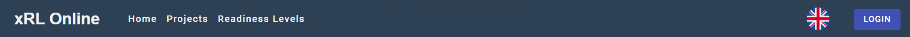
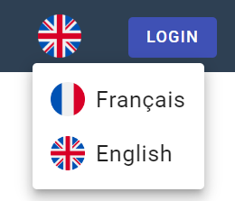
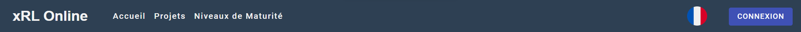
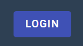
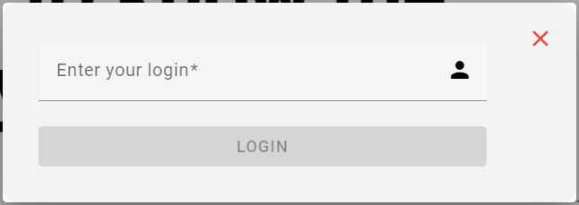
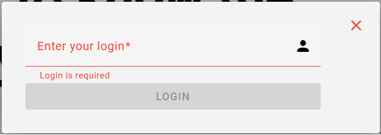
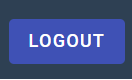

# Navigation

The NavBar element is composed of two part:

- On the left, the navigation menu with the differents pages
- On the right, the language & login/logout system

#### Navigation Menu

The navigation menu show to the user the differents pages that he has access to :

- [Home]()
- [Projects]()
- [Readiness Levels]()

# Language & Login/Logout

Both the language and the login/logout systems are very simple:

#### Language

By clicking on the "language button" a small dialog will appear.

 

It allows you to change the language of the web application (except what Users have stored in database, for example: a [Project]() description).

#### Login

If you are not logged in, the login button will appear on the right of the navbar.

When a [User]() click on the login button, a dialog open and ask for a username.

- If the username field remains empty, an error appears
- If the username does not correspond to a user stored in the database, an error appears

#### Logout

- If you are logged in, the login button will disappear and the logout button will replace it

When a [User]() click on the logout button :

- He'll get disconnected