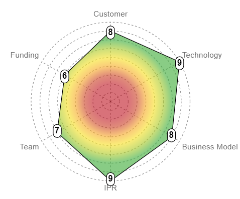
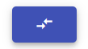

# Project-Page

This page aims to provide all the information on a project's assessments as well as to allow the connected user to make all the creations/modifications of the assessments that they have the right to do.

## Tabs

#### Informations

This tab brings together all the project informations: 
- Name
- Description
- The associated Team
- The associated BusinessLine
- The project's start date
- The number of Assessments

You can see who are the team members by clicking on the "i" icon :

#### Assesment

This tab shows the currently-selected Assessment's comment. Allowing the User to have some informations about it.

If the current User is a member of the associated Team, he has access to the "Draft" checkbox, allowing him to activate or deactivate the modifications features.

##### Detailed Readiness Level

This tab brings together informations about the selected Readiness Level of the currently-selected Assessment:

- Name
- Description
- Rank value
- Rank comment (entered by the User who chose to set that rank)

By clicking on the "i" icon, the User can display the detailed and long descriptions for that specific rank for that specific Readiness Level.

#### History

This tab's goal is to display every Readiness Level evolution accross the projet duration.

It is possible to hide some Readiness Levels by clicking on their label and to make them all reappears by clicking on the "refrech" icon.

## Chart

#### Assessment details

Clicking on any labels or associated rank will change the displayed Readiness Level in the Detailed Readiness Level tab (here: "Team" or "7").

It will also focus the linear graph on that Readiness Level inside the History tab.

#### Versionning

By using the arrows-navigation system, the User is able to visit former version of the Project, older Assessment.
Which will change the informations displayed in both the Assessment & Detailed Readiness Level tabs.

## Buttons

#### Create / Update Assessment

If the User is a member of the associated Team, he'll be able to create a whole new Assessment, with pre-fill informations took from the former one. However, if the last Assessment is in "Draft" mode he'll not be able to create a new one but only to update it.
Additionnaly, if an Assessment has already been created the same day, the User will not be able to create a new one.

By clicking on any of those, a dialog will appear and asks the User to choose the Readiness Level he wants to have in the next Assessment.

Then, for every selected Readiness Level, the User will have to choose a rank and enter a comment to give informations on why he's choosing this specific rank.

When it's done, the User will have to choose the Tag of the Assessment and if it's a Draft or not (which can be change in the Assessment tab). The first created Assessment has always a Tag "INITIAL".

Finally, A comparison with the latest Assessment or a visualisation (only for the "INITIAL" one) will appear.

#### Comparison

By clicking on the "Comparison" button the User opens a dialog allowing him to select two Assessments from the project and compare them with two different visualisation, "Overlay" or "Side by side".

#### Report Download

By clicking on the "Document" button, the User has the choice to download a report in two different format:

- PDF
- PPTX

Both reports will have informations of the project final state and also a summary section and of course the project details.

#### Copy & Download the chart

The user also has access to two smaller buttons.

One allowing him to copy into the clipboard the currently-selected Assessment.

And the other for downloading it in a .png format.