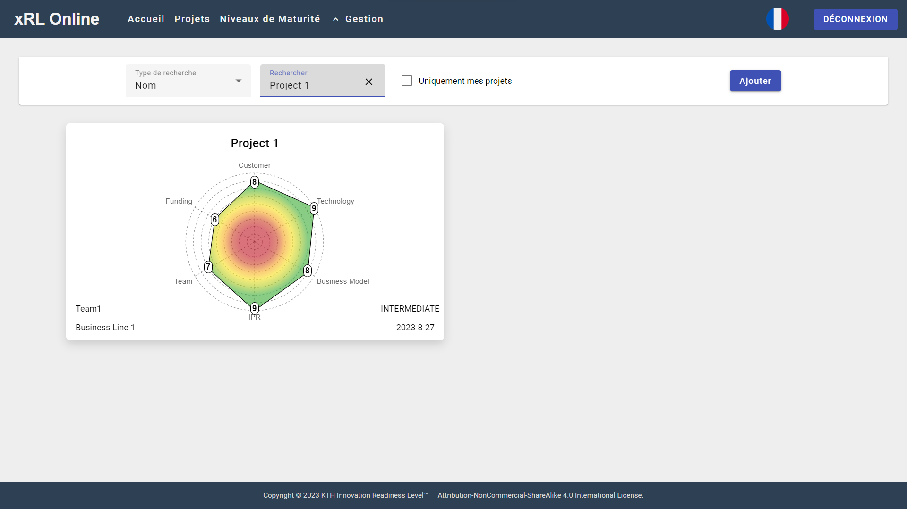
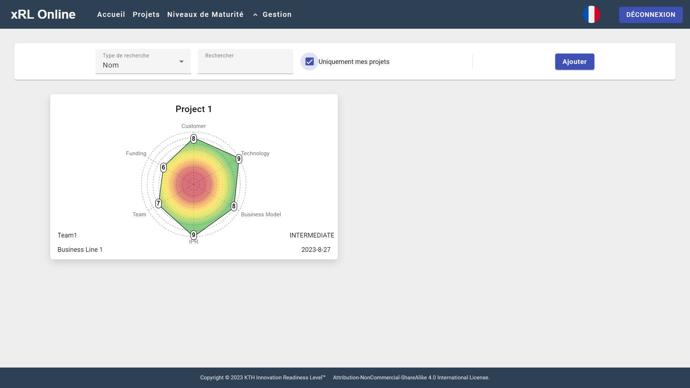
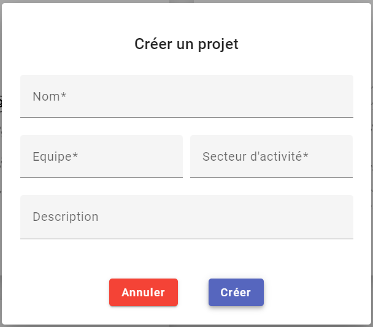
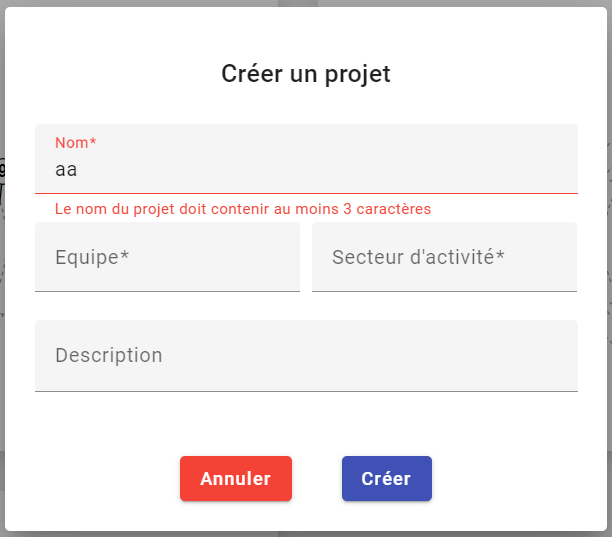
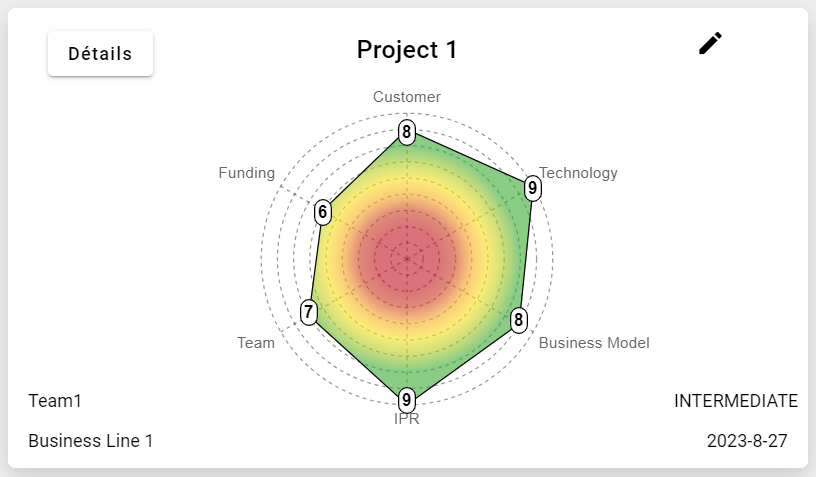
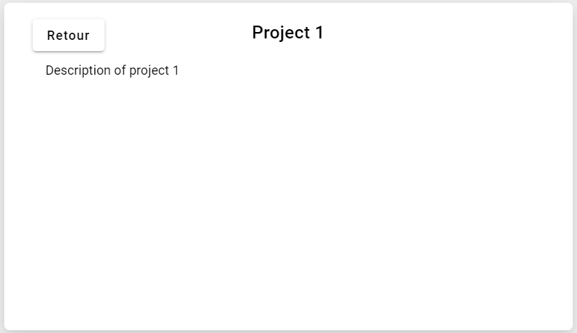
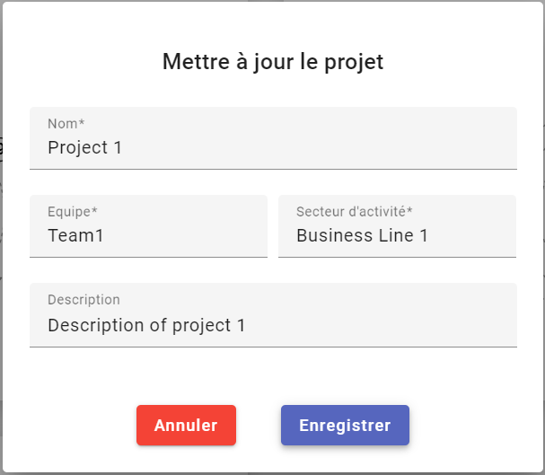

# Projects-Page

This page aims to list, search and access every [Project]().
  It is made of two parts.

![![Main page]](../assets/screenshots/projects-page/main-page.png)

## Search bar

At the top, a search bar with various filters allows the [User]() to search a [Project]() by:
- The Name
- The associated [Team]()
- The associated [BusinessLine]().

![[Search bar]](../assets/screenshots/projects-page/search-bar-1.png)

This search bar also includes a checkbox allowing the [User]() to only display the Project he's linked to.

Finally by clicking the "add Button" any User can create a whole new [Project]().

A dialog then appears and ask the User to fill differents informations:

- Project Name
- Associated [Team]() (can only select Teams to which he's linked)
- Associated [BusinessLine]()
- Description (optional)

The [User]() cannot chose a name of an already existing Projet, and have to respect the field criterias:

- Not less than 3 characters
- Not more than 20 characters

## Projects cards

Every project card contains:

- The associated [Team]()
- The associated [BusinessLine]()
- The [Project]() informations such as
    - Name
    - Description (On the back of the card)
    - Current Tag
    - Date of the last Assessment
    - The [xRL graph]()

If the User is a member of the [Team](), he has the rights to update the Project by clicking on the "edit Button".
Which will open a similar [dialog]() than to create a Project

By clicking on any [Project]() card you will be sent to its detailed page.