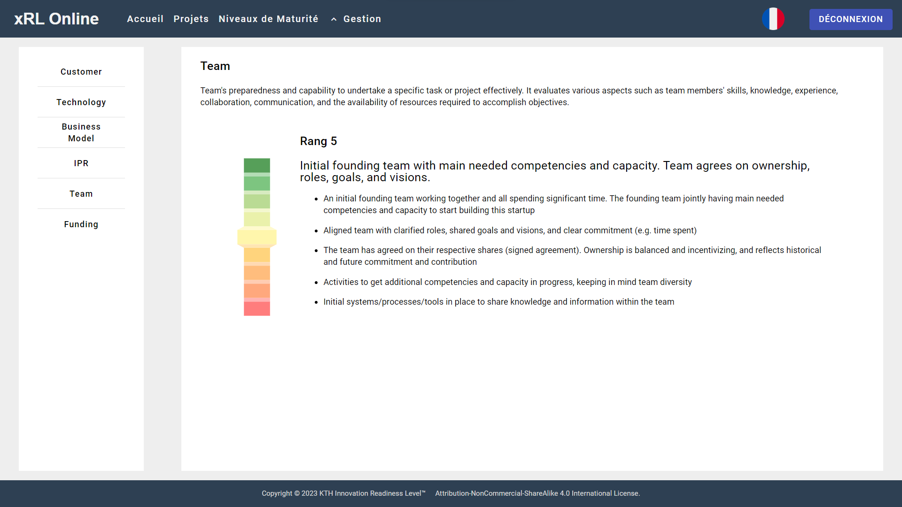

# Readiness-Levels-Page

This page aims to list and present every [Readiness Levels]().
  It is made of two parts.

## Navigation bar

On the left, a navigation bar listing every [Readiness Levels]() allowing the User to navigate threw them.

## Readiness Level details

The detailed part is itself made of two single parts:

- The [Readiness Level]() title and description
- A list of the short & long descriptions of each [Level]()

By clicking on the gauge the User can change the rank and so the short & long descriptions